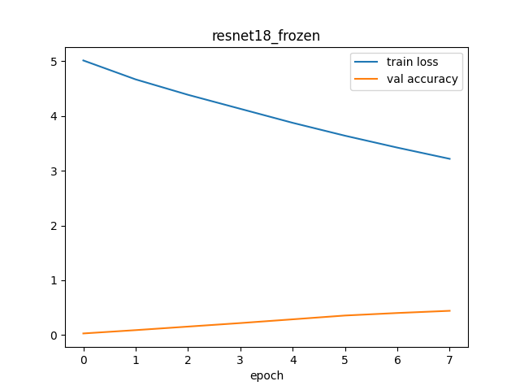
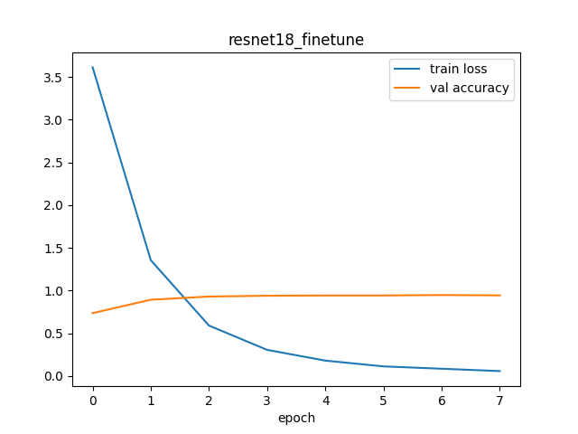
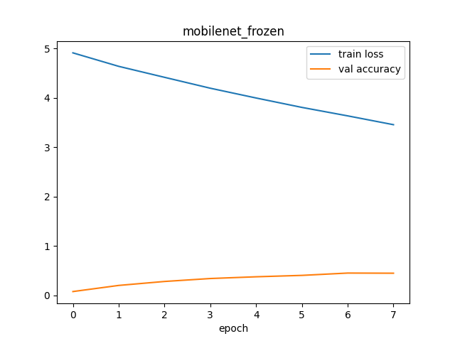
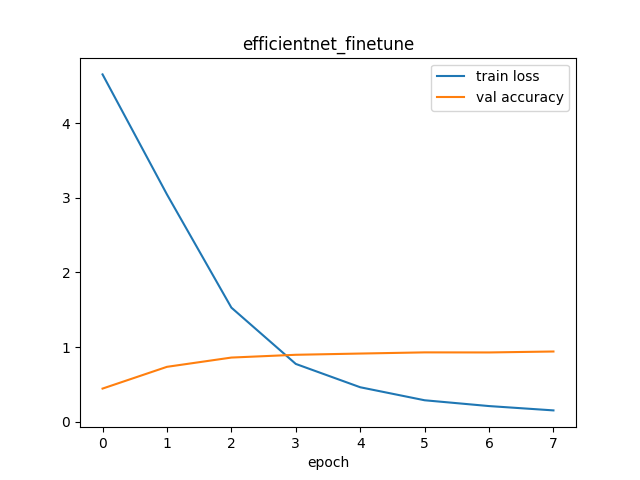
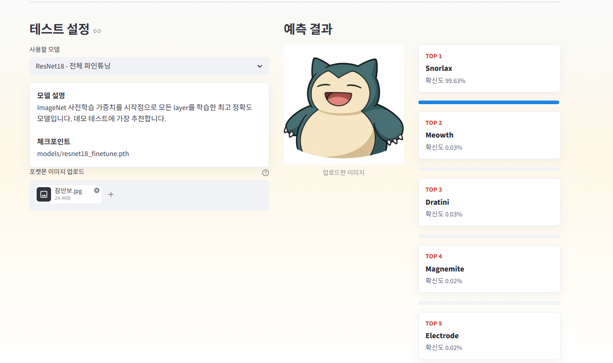

# 포켓몬 이미지 분류기 - Transfer Learning

이 프로젝트는 포켓몬 이미지를 입력받아 150개 클래스 중 어떤 포켓몬인지 예측하는 이미지 분류 모델입니다.
Kaggle의 `lantian773030/pokemonclassification` 데이터셋을 사용했으며, transfer learning 기반의 4가지 실험 설정을 비교했습니다.

## 프로젝트 목표

- 입력 이미지에서 포켓몬 이름 예측
- 4개 이상의 실험 설정으로 classifier 학습 및 성능 비교
- test accuracy, macro precision, macro recall, macro F1-score 문서화
- learning curve 이미지 포함
- Streamlit 기반 데모 GUI 제공

## 프로젝트 구조

```text
.
+-- app.py
+-- train.py
+-- requirements.txt
+-- assets/
|   +-- pokemon_hero.png
|   +-- result_ex.png
+-- models/
|   +-- resnet18_frozen.pth
|   +-- resnet18_finetune.pth
|   +-- mobilenet_frozen.pth
|   +-- efficientnet_finetune.pth
+-- results/
    +-- experiment_results.csv
    +-- resnet18_frozen_curve.png
    +-- resnet18_finetune_curve.png
    +-- mobilenet_frozen_curve.png
    +-- efficientnet_finetune_curve.png
```

## 데이터셋

- 데이터셋: 7,000 labeled Pokemon images
- 클래스 수: 150개
- 출처: Kaggle `lantian773030/pokemonclassification`
- 다운로드 방식: `kagglehub`
- 데이터 분할: train 70%, validation 15%, test 15%
- 입력 이미지 크기: 224 x 224

## 실험 설정

| 실험 이름 | Backbone | ImageNet 사전학습 | 학습 방식 |
| --- | --- | --- | --- |
| `resnet18_frozen` | ResNet18 | 사용 | backbone 고정, classifier head만 학습 |
| `resnet18_finetune` | ResNet18 | 사용 | 전체 layer fine-tuning |
| `mobilenet_frozen` | MobileNetV2 | 사용 | backbone 고정, classifier head만 학습 |
| `efficientnet_finetune` | EfficientNet-B0 | 사용 | 전체 layer fine-tuning |

## 테스트 성능 비교

| 실험 이름 | Accuracy | Macro Precision | Macro Recall | Macro F1 |
| --- | ---: | ---: | ---: | ---: |
| `resnet18_frozen` | 0.4653 | 0.5526 | 0.4830 | 0.4430 |
| `resnet18_finetune` | 0.9492 | 0.9507 | 0.9495 | 0.9440 |
| `mobilenet_frozen` | 0.4506 | 0.5466 | 0.4681 | 0.4301 |
| `efficientnet_finetune` | 0.9443 | 0.9469 | 0.9501 | 0.9441 |

가장 높은 test accuracy와 macro precision은 `resnet18_finetune`에서 나왔습니다.
`efficientnet_finetune`은 macro recall이 가장 높았고, macro F1-score도 `resnet18_finetune`과 거의 비슷했습니다.
반면 frozen backbone 실험들은 전체 fine-tuning 실험보다 성능이 낮았습니다.
이를 통해 이 데이터셋에서는 pretrained backbone을 단순 feature extractor로 쓰는 것보다 전체 fine-tuning이 더 효과적임을 확인할 수 있습니다.

## Learning Curve

### ResNet18 Frozen



### ResNet18 Fine-tuning



### MobileNetV2 Frozen



### EfficientNet-B0 Fine-tuning



## 실행 방법

필요한 패키지를 설치합니다.

```bash
pip install -r requirements.txt
```

4가지 실험을 모두 다시 학습하려면 아래 명령어를 실행합니다.

```bash
python train.py
```

이미 학습된 모델로 데모 GUI만 실행하려면 아래 명령어를 실행합니다.

```bash
python -m streamlit run app.py
```

## 결과 예시 이미지 (잠만보)




## 데모 GUI

Streamlit 데모에서는 다음 기능을 제공합니다.

- 학습된 모델 체크포인트 선택
- 테스트할 포켓몬 이미지 업로드
- 업로드한 이미지 미리보기
- Top-5 예측 결과와 confidence score 확인

대표 화면 이미지는 `assets/pokemon_hero.png`를 사용합니다.

## 구현 메모

- 150개 클래스의 다중 분류 문제이므로 macro precision, macro recall, macro F1-score를 함께 사용했습니다.
- 모델 체크포인트에는 `model_state_dict`, `class_names`, `exp_name`을 함께 저장했습니다.
- 데모 앱은 체크포인트 안의 class 이름을 불러오기 때문에 학습 당시의 label mapping을 그대로 사용할 수 있습니다.
